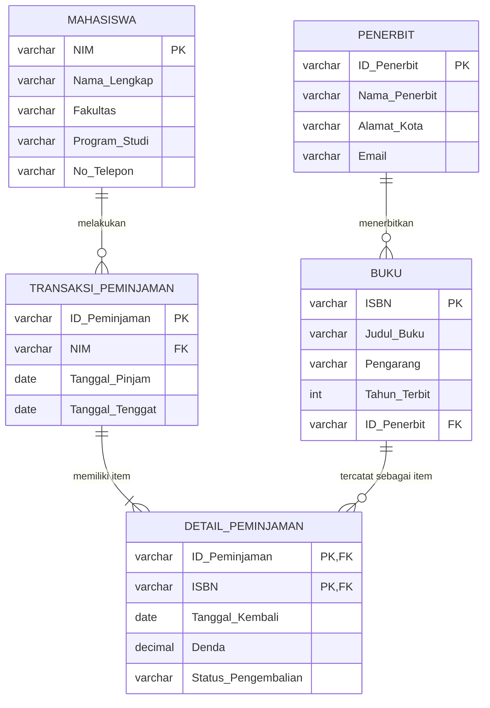
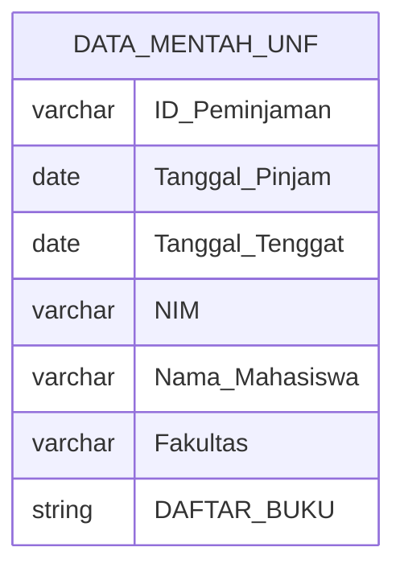
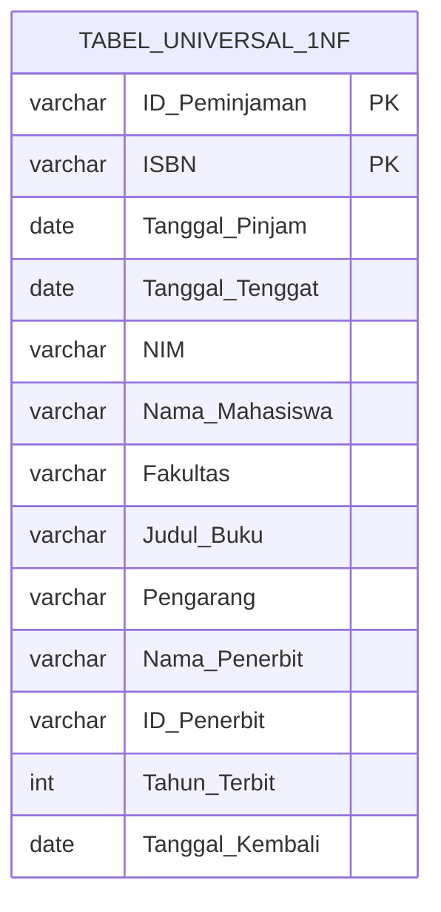
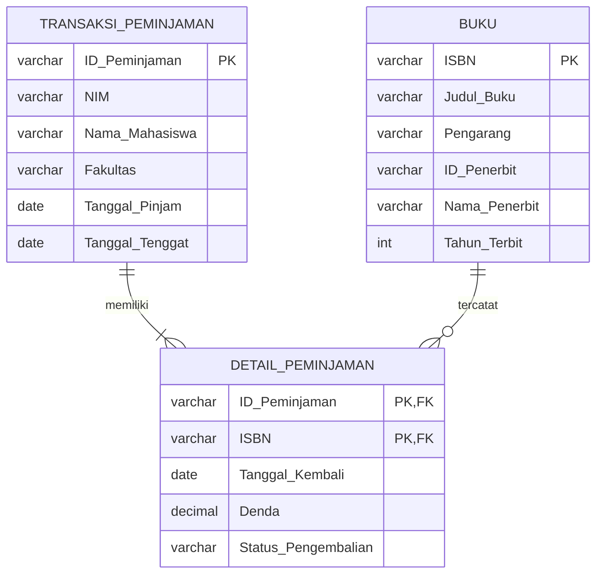
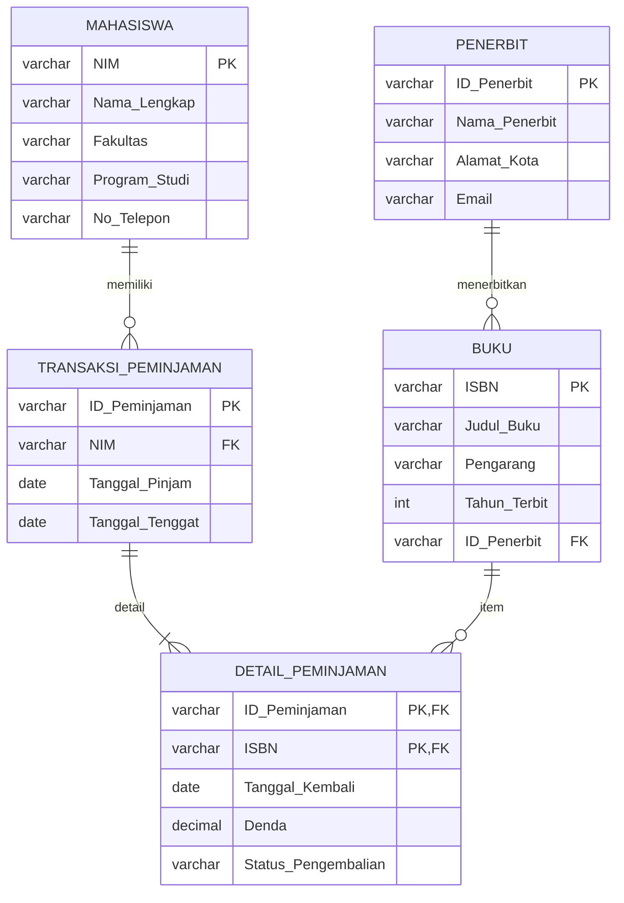
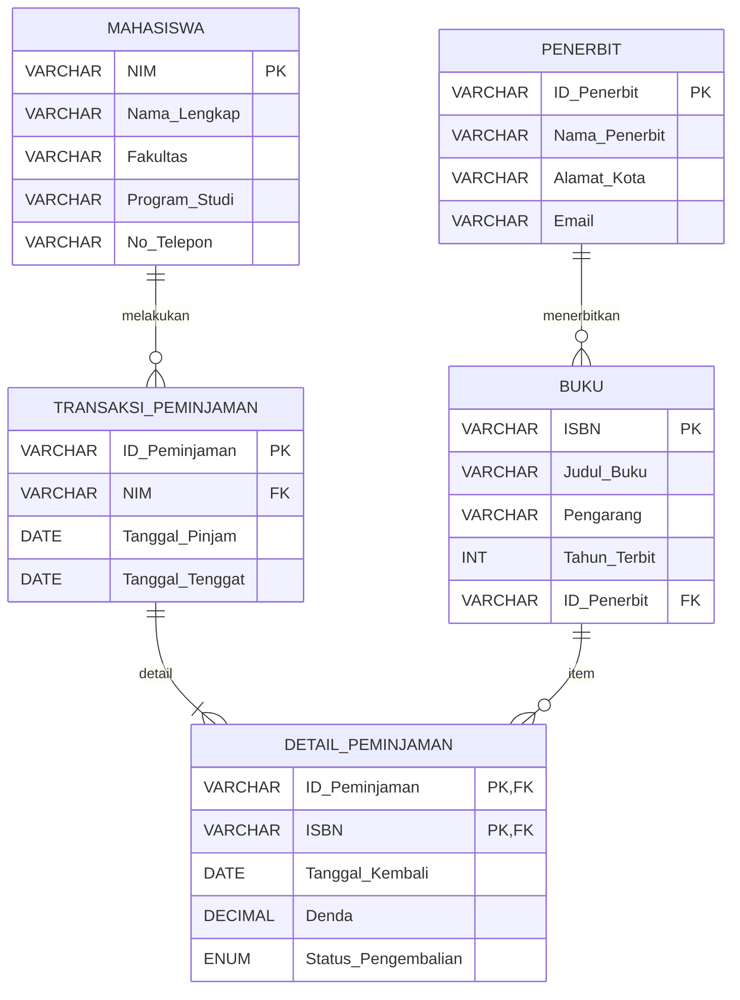

# Tugas Mandiri: Perancangan ERD E-Library Kampus

## 1. Desain ERD Logis (Entitas dan Atribut)

Dalam perancangan basis data ini, terdapat 5 entitas utama (termasuk satu entitas junction untuk memecah relasi many-to-many antara Transaksi_Peminjaman dan Buku):

1. **Mahasiswa**
   - `NIM` (Primary Key)
   - `Nama_Lengkap`
   - `Fakultas`
   - `Program_Studi`
   - `No_Telepon`

2. **Penerbit**
   - `ID_Penerbit` (Primary Key)
   - `Nama_Penerbit`
   - `Alamat_Kota`
   - `Email`

3. **Buku**
   - `ISBN` (Primary Key)
   - `Judul_Buku`
   - `Pengarang`
   - `Tahun_Terbit`
   - `ID_Penerbit` (Foreign Key - referensi ke Penerbit)

4. **Transaksi_Peminjaman**
   - `ID_Peminjaman` (Primary Key)
   - `NIM` (Foreign Key - referensi ke Mahasiswa)
   - `Tanggal_Pinjam`
   - `Tanggal_Tenggat`

5. **Detail_Peminjaman** _(Entitas Junction)_
   - `ID_Peminjaman` (Composite Primary Key, Foreign Key - referensi ke Peminjaman)
   - `ISBN` (Composite Primary Key, Foreign Key - referensi ke Buku)
   - `Tanggal_Kembali`
   - `Denda`
   - `Status_Pengembalian`

## 2. Visualisasi Relasi Kunci (ERD)

Relasi antar-entitas pada sistem E-Library adalah:

- Mahasiswa dapat melakukan banyak peminjaman.
- Setiap peminjaman dilakukan oleh satu mahasiswa.
- Penerbit dapat menerbitkan banyak buku.
- Setiap buku berasal dari satu penerbit.
- Satu peminjaman dapat memiliki banyak buku.
- Satu buku dapat tercatat pada banyak transaksi peminjaman.
- Relasi many-to-many antara Transaksi \_Peminjaman dan Buku dipecahkan menggunakan `Detail_Peminjaman`.

## 3. Simulasi Normalisasi

### 3.1 Bentuk Tidak Normal (UNF)

Pada tahap UNF, data peminjaman masih mengandung repeating group. Satu transaksi peminjaman dapat memiliki beberapa buku yang disimpan dalam `DAFTAR_BUKU`.

`DAFTAR_BUKU` merupakan repeating group yang berisi beberapa data buku, yaitu:

- ISBN
- Judul_Buku
- Pengarang
- ID_Penerbit
- Nama_Penerbit
- Tahun_Terbit
- Tanggal_Kembali

Karena satu atribut masih dapat berisi lebih dari satu kelompok data buku, struktur tersebut belum memenuhi 1NF.

### 3.2 Bentuk Normal Pertama (1NF)

Pada tahap 1NF, repeating group dihilangkan. Setiap atribut harus memiliki nilai yang atomik.

Jika satu transaksi meminjam tiga buku, maka transaksi tersebut dicatat menjadi tiga baris berbeda.

Struktur tabel pada tahap 1NF:

Primary Key pada tahap 1NF adalah kombinasi:

`ID_Peminjaman + ISBN`

Kombinasi tersebut memastikan setiap buku dalam suatu transaksi peminjaman dapat diidentifikasi secara unik.

## 3.3 Bentuk Normal Kedua (2NF)

Pada 2NF, dependensi parsial dihilangkan.

Atribut yang hanya bergantung pada `ID_Peminjaman` dipisahkan ke tabel `TRANSAKSI_PEMINJAMAN`.

Atribut yang hanya bergantung pada `ISBN` dipisahkan ke tabel `BUKU`.

Atribut yang bergantung pada kombinasi `ID_Peminjaman` dan `ISBN` ditaruh pada entitas baru, yaitu `DETAIL_PEMINJAMAN`.

Pada tahap ini:

- `ID_Peminjaman` menjadi Primary Key pada `TRANSAKSI_PEMINJAMAN`.
- `ISBN` menjadi Primary Key pada `BUKU`.
- Kombinasi `ID_Peminjaman` dan `ISBN` menjadi Primary Key komposit pada `DETAIL_PEMINJAMAN`.
- `DETAIL_PEMINJAMAN` menjadi penghubung antara `TRANSAKSI_PEMINJAMAN` dan `BUKU`.

## 3.4 Bentuk Normal Ketiga (3NF)

Pada 3NF, dependensi transitif dihilangkan.

Pada tabel `TRANSAKSI_PEMINJAMAN`, `Nama_Mahasiswa` dan `Fakultas` bergantung pada `NIM`, bukan langsung pada `ID_Peminjaman`. Oleh karena itu, data tersebut dipisahkan menjadi tabel `MAHASISWA`.

Pada tabel `BUKU`, `Nama_Penerbit` bergantung pada `ID_Penerbit`, bukan langsung pada `ISBN`. Oleh karena itu, data tersebut dipisahkan menjadi tabel `PENERBIT`.

Hasil normalisasi 3NF:

Dengan demikian, hasil akhir 3NF terdiri dari lima tabel:

1. `MAHASISWA`
2. `PENERBIT`
3. `BUKU`
4. `TRANSAKSI_PEMINJAMAN`
5. `DETAIL_PEMINJAMAN`

## 4. Rancangan Tabel Akhir

Berdasarkan hasil normalisasi hingga 3NF, diperoleh lima tabel akhir, yaitu `Mahasiswa`, `Penerbit`, `Buku`, `Transaksi_Peminjaman`, dan `Detail_Peminjaman`.

### 4.1 Visualisasi ERD Final

### 4.2 Tabel Mahasiswa

| Nama Kolom      | Tipe Data | Panjang | Keterangan              |
| :-------------- | :-------- | :-----: | :---------------------- |
| `NIM`           | VARCHAR   |   15    | **Primary Key**         |
| `Nama_Lengkap`  | VARCHAR   |   100   | Not Null                |
| `Fakultas`      | VARCHAR   |   50    | Not Null                |
| `Program_Studi` | VARCHAR   |   50    | Not Null                |
| `No_Telepon`    | VARCHAR   |   15    | Nomor telepon mahasiswa |

### 4.3 Tabel Penerbit

| Nama Kolom      | Tipe Data | Panjang | Keterangan           |
| :-------------- | :-------- | :-----: | :------------------- |
| `ID_Penerbit`   | VARCHAR   |   10    | **Primary Key**      |
| `Nama_Penerbit` | VARCHAR   |   100   | Not Null             |
| `Alamat_Kota`   | VARCHAR   |   50    | Kota/alamat penerbit |
| `Email`         | VARCHAR   |   100   | Unique               |

### 4.4 Tabel Buku

| Nama Kolom     | Tipe Data |        Panjang         | Keterangan                 |
| :------------- | :-------- | :--------------------: | :------------------------- |
| `ISBN`         | VARCHAR   |           20           | **Primary Key**            |
| `Judul_Buku`   | VARCHAR   |          200           | Not Null                   |
| `Pengarang`    | VARCHAR   |          100           | Not Null                   |
| `Tahun_Terbit` | INT       | Tahun penerbitan buku4 | Tahun penerbitan buku      |
| `ID_Penerbit`  | VARCHAR   |           10           | **Foreign Key** (Penerbit) |

### 4.5 Tabel Peminjaman

| Nama Kolom        | Tipe Data | Panjang | Keterangan                  |
| :---------------- | :-------- | :-----: | :-------------------------- |
| `ID_Peminjaman`   | VARCHAR   |   15    | **Primary Key**             |
| `NIM`             | VARCHAR   |   15    | **Foreign Key** (Mahasiswa) |
| `Tanggal_Pinjam`  | DATE      |    -    | Not Null                    |
| `Tanggal_Tenggat` | DATE      |    -    | Not Null                    |

### 4.6 Tabel Detail_Peminjaman

| Nama Kolom            | Tipe Data | Panjang | Keterangan                          |
| :-------------------- | :-------- | :-----: | :---------------------------------- |
| `ID_Peminjaman`       | VARCHAR   |   15    | **PK Komposit, FK** (Peminjaman)    |
| `ISBN`                | VARCHAR   |   20    | **PK Komposit, FK** (Buku)          |
| `Tanggal_Kembali`     | DATE      |    -    | Nullable, kosong jika belum kembali |
| `Denda`               | DECIMAL   |  10,2   | Default 0                           |
| `Status_Pengembalian` | ENUM      |    -    | `Dipinjam`, `Kembali`, `Terlambat`  |
