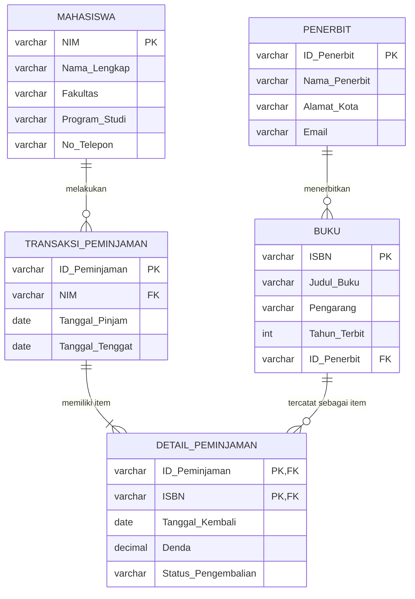

# Tugas Mandiri: Perancangan ERD E-Library Kampus

## 1. Desain ERD Logis (Entitas dan Atribut)

Dalam perancangan basis data ini, terdapat 5 entitas utama (termasuk satu entitas junction untuk memecah relasi many-to-many antara Transaksi_Peminjaman dan Buku):

1. **Mahasiswa**
   - `NIM` (Primary Key)
   - `Nama_Lengkap`
   - `Fakultas`
   - `Program_Studi`
   - `No_Telepon`

2. **Penerbit**
   - `ID_Penerbit` (Primary Key)
   - `Nama_Penerbit`
   - `Alamat_Kota`
   - `Email`

3. **Buku**
   - `ISBN` (Primary Key)
   - `Judul_Buku`
   - `Pengarang`
   - `Tahun_Terbit`
   - `ID_Penerbit` (Foreign Key - referensi ke Penerbit)

4. **Transaksi_Peminjaman**
   - `ID_Peminjaman` (Primary Key)
   - `NIM` (Foreign Key - referensi ke Mahasiswa)
   - `Tanggal_Pinjam`
   - `Tanggal_Tenggat`

5. **Detail_Peminjaman** _(Entitas Junction)_
   - `ID_Peminjaman` (Composite Primary Key, Foreign Key - referensi ke Peminjaman)
   - `ISBN` (Composite Primary Key, Foreign Key - referensi ke Buku)
   - `Tanggal_Kembali`
   - `Denda`
   - `Status_Pengembalian`

## 2. Visualisasi Relasi Kunci (ERD)

Relasi antar-entitas pada sistem E-Library adalah:

- Mahasiswa dapat melakukan banyak peminjaman.
- Setiap peminjaman dilakukan oleh satu mahasiswa.
- Penerbit dapat menerbitkan banyak buku.
- Setiap buku berasal dari satu penerbit.
- Satu peminjaman dapat memiliki banyak buku.
- Satu buku dapat tercatat pada banyak transaksi peminjaman.
- Relasi many-to-many antara Transaksi \_Peminjaman dan Buku dipecahkan menggunakan `Detail_Peminjaman`.

